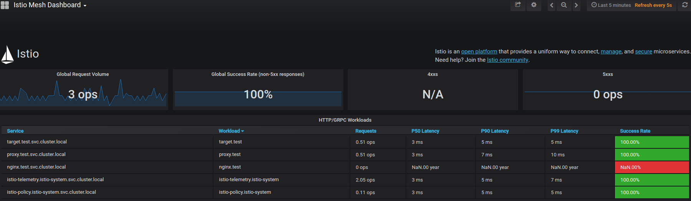
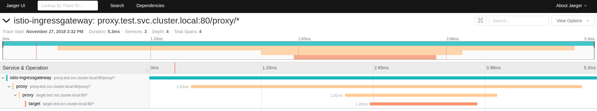

# istio-多服务通信

[TOC]

在之前的示例中,我们在istio中启动了nginx,tomcat等服务,那在此节中,我们再深入的进行一些功能的使用;

在微服务的背景下,现在越来越多的被拆分为单个服务了,那么这些服务怎么在istio上运行,服务间如何进行通信呢?在本节中我们将尝试构建一个proxy服务和target服务
## 服务规划


> 请忽略nginx,这个是我用来做测试的...

### proxy服务

proxy服务使用golang进行构建,serviceProxy.go文件内容如下:

```go
package main

import (
	"fmt"
	"io/ioutil"
	"log"
	"net/http"
	"os"
)

func main() {
	http.HandleFunc("/proxy", handler)
	http.HandleFunc("/index", indexHandler)
	serve := http.ListenAndServe("0.0.0.0:8090", nil)
	if serve != nil {
		log.Fatalf("启动失败,%v", serve)
	} else {
		fmt.Fprintf(os.Stdout, "启动成功")
	}
}

func handler(writer http.ResponseWriter, request *http.Request) {
	fmt.Printf("proxy请求begin\n")
	request.ParseForm()
	get := request.Form.Get("url")
	fmt.Printf("请求地址:%s\n", get)
	for key, value := range request.Form {
		fmt.Printf("请求参数 [%s]:%s \n", key, value)
	}
	for key, value := range request.Header {
		fmt.Printf("header参数 [%s]:%s \n", key, value)
	}

	client := http.DefaultClient
	newRequest, e := http.NewRequest("GET", get, nil)
	if e != nil {
		fmt.Printf("NewRequest error: %v", e)
	}

	//设置header
    //在istio中,header
	if len(request.Header.Get("x-request-id")) > 0 {
		newRequest.Header.Set("x-request-id", request.Header.Get("x-request-id"))
	}
	if len(request.Header.Get("x-b3-traceid")) > 0 {
		newRequest.Header.Set("x-b3-traceid", request.Header.Get("x-b3-traceid"))
	}
	if len(request.Header.Get("x-b3-spanid")) > 0 {
		newRequest.Header.Set("x-b3-spanid", request.Header.Get("x-b3-spanid"))
	}
	if len(request.Header.Get("x-b3-parentspanid")) > 0 {
		newRequest.Header.Set("x-b3-parentspanid", request.Header.Get("x-b3-parentspanid"))
	}
	if len(request.Header.Get("x-b3-sampled")) > 0 {
		newRequest.Header.Set("x-b3-sampled", request.Header.Get("x-b3-sampled"))
	}
	if len(request.Header.Get("x-b3-flags")) > 0 {
		newRequest.Header.Set("x-b3-flags", request.Header.Get("x-b3-flags"))
	}
	if len(request.Header.Get("x-ot-span-context")) > 0 {
		newRequest.Header.Set("x-ot-span-context", request.Header.Get("x-ot-span-context"))
	}

	resp, err := client.Do(newRequest)
	if err != nil {
		fmt.Fprintf(writer, "response:%v", err)
	} else {
		bytes, _ := ioutil.ReadAll(resp.Body)
		defer resp.Body.Close()
		fmt.Fprintf(writer, "%s", bytes)
	}
	fmt.Printf("proxy请求end\n")
}

func indexHandler(writer http.ResponseWriter, request *http.Request) {
	fmt.Printf("index请求begin\n")
	for key, value := range request.Form {
		fmt.Printf("请求参数 [%s]:%s \n", key, value)
	}
	for key, value := range request.Header {
		fmt.Printf("header参数 [%s]:%s \n", key, value)
	}
	fmt.Fprintf(writer, "%s", "index")
	fmt.Printf("index请求end\n")

}
```
将proxy服务构建为镜像:
```shell
$ go build serviceProxy.go
$ docker build -t service-proxy:go-1
```

### target服务

target服务使用java进行构建,TestController.java文件内容如下:

```java
package com.tanx.istio.demo;


import org.springframework.beans.factory.annotation.Autowired;
import org.springframework.http.*;
import org.springframework.web.bind.annotation.RequestHeader;
import org.springframework.web.bind.annotation.RequestMapping;
import org.springframework.web.bind.annotation.RestController;
import org.springframework.web.client.RestTemplate;

import java.util.Collections;

@RestController
@RequestMapping
public class TestController {
    @Autowired
    private RestTemplate restTemplate;

    @RequestMapping("/proxy")
    public String proxy(@RequestHeader(value = "end-user", required = false) String user,
                        @RequestHeader(value = "x-request-id", required = false) String xreq,
                        @RequestHeader(value = "x-b3-traceid", required = false) String xtraceid,
                        @RequestHeader(value = "x-b3-spanid", required = false) String xspanid,
                        @RequestHeader(value = "x-b3-parentspanid", required = false) String xparentspanid,
                        @RequestHeader(value = "x-b3-sampled", required = false) String xsampled,
                        @RequestHeader(value = "x-b3-flags", required = false) String xflags,
                        @RequestHeader(value = "x-ot-span-context", required = false) String xotspan,
                        String url) {
	System.out.println("=============请求header============");
        System.out.println("end-user:"+user);
        System.out.println("x-request-id:"+xreq);
        System.out.println("x-b3-traceid:"+xtraceid);
        System.out.println("x-b3-spanid:"+xspanid);
        System.out.println("x-b3-parentspanid:"+xparentspanid);
        System.out.println("x-b3-sampled:"+xsampled);
        System.out.println("x-b3-flags:"+xflags);
        System.out.println("x-ot-span-context:"+xotspan);
        System.out.println("=============请求header============");

        System.out.println("=============请求url============");
        System.out.println(url);
        System.out.println("=============请求url============");
        HttpHeaders requestHeaders = new HttpHeaders();
        if (xreq != null) {
            requestHeaders.put("x-request-id", Collections.singletonList(xreq));
        }
        if (xtraceid != null) {
            requestHeaders.put("x-b3-traceid", Collections.singletonList(xtraceid));
        }
        if (xspanid != null) {
            requestHeaders.put("x-b3-spanid", Collections.singletonList(xspanid));
        }
        if (xparentspanid != null) {
            requestHeaders.put("x-b3-parentspanid", Collections.singletonList(xparentspanid));
        }
        if (xsampled != null) {
            requestHeaders.put("x-b3-sampled", Collections.singletonList(xsampled));
        }
        if (xflags != null) {
            requestHeaders.put("x-b3-flags", Collections.singletonList(xflags));
        }
        if (xotspan != null) {
            requestHeaders.put("x-ot-span-context", Collections.singletonList(xotspan));
        }
        if (user != null) {
            requestHeaders.put("end-user", Collections.singletonList(user));
        }

        ResponseEntity<String> exchange = restTemplate.exchange(url, HttpMethod.GET, new HttpEntity<>(requestHeaders), String.class);
        String body = exchange.getBody();
        System.out.println("代理返回内容为:" + body);
        return body;
    }

    @RequestMapping("index")
    public String index(@RequestHeader(value = "end-user", required = false) String user,
                        @RequestHeader(value = "x-request-id", required = false) String xreq,
                        @RequestHeader(value = "x-b3-traceid", required = false) String xtraceid,
                        @RequestHeader(value = "x-b3-spanid", required = false) String xspanid,
                        @RequestHeader(value = "x-b3-parentspanid", required = false) String xparentspanid,
                        @RequestHeader(value = "x-b3-sampled", required = false) String xsampled,
                        @RequestHeader(value = "x-b3-flags", required = false) String xflags,
                        @RequestHeader(value = "x-ot-span-context", required = false) String xotspan) {
	System.out.println("=============请求header============");
        System.out.println("end-user:"+user);
        System.out.println("x-request-id:"+xreq);
        System.out.println("x-b3-traceid:"+xtraceid);
        System.out.println("x-b3-spanid:"+xspanid);
        System.out.println("x-b3-parentspanid:"+xparentspanid);
        System.out.println("x-b3-sampled:"+xsampled);
        System.out.println("x-b3-flags:"+xflags);
        System.out.println("x-ot-span-context:"+xotspan);
        System.out.println("=============请求header============");

        return "index-java";
    }

}
```
将proxy服务构建为镜像:
```shell
$ mvn clean&&mvn package -Dmaven.test.skip=true
$ docker build -t service-proxy:java-1
```

在这里可能会有很多人有疑问,为什么要我都构建为service-proxy名称的镜像,并且这两个镜像中还存在基本一样的行为(都开放两个接口proxy,index)?

原因如下:

- 我需要演示两个服务间相互调用,两个服务一致,可以让我们调用更为方便
- 使用两种语言可以充分的模拟企业中不同的服务状态

## kubernetes配置

k8s.yaml内容如下:

```yaml
apiVersion: extensions/v1beta1
kind: Deployment
metadata:
 name: target
 namespace: test
 labels:
   app: target #必须有app和version标签
   version: v1
spec:
 template:
    metadata:
     labels:
       app: target
       version: v1
    spec:
     containers:
     - name: target
       image: service-proxy:java-1
       ports:
       - containerPort: 8090
         name: http-target
         protocol: TCP
---
kind: Service
apiVersion: v1
metadata:
  name: target
  namespace: test
spec:
  type: ClusterIP
  selector:
    app: target
  ports:
    - port: 80
      name: http-target #必须为服务端口命名,端口名称必须是形式<protocol>[-<suffix>]与http, http2, grpc, mongo, or redis as the <protocol>
      protocol: TCP
      targetPort: 8090
---
apiVersion: extensions/v1beta1
kind: Deployment
metadata:
 name: proxy
 namespace: test
 labels:
   app: proxy
   version: v1
spec:
 template:
    metadata:
     labels:
       app: proxy
       version: v1
    spec:
     containers:
     - name: proxy
       image: service-proxy:java-1
       ports:
       - containerPort: 8090
         name: http-proxy
         protocol: TCP
---
kind: Service
apiVersion: v1
metadata:
  name: proxy
  namespace: test
spec:
  type: ClusterIP
  selector:
    app: proxy
  ports:
    - port: 80
      name: http-proxy
      protocol: TCP
      targetPort: 8090
```
### 部署应用

```shell
$ kubectl craete namespace test
$ kubectl apply -f < (istioctl kube-inject -f k8s.yaml)
$ kubectl get all -n test
```

### 部署istio编排文件

istio.yaml文件如下:

```yaml
apiVersion: networking.istio.io/v1alpha3
kind: Gateway
metadata:
  name: test4
  namespace: test
spec:
  selector:
    istio: ingressgateway
  servers:
  - port:
      number: 80
      name: http
      protocol: HTTP
    hosts:
    - "*"
---
apiVersion: networking.istio.io/v1alpha3
kind: VirtualService
metadata:
  name: proxy
  namespace: test
spec:
  hosts:
  - "*"
  gateways:
  - test4
  http:
  - match:
    - uri:
        prefix: /proxy/
    rewrite:
      uri: "/"
    route:
    - destination:
       host: proxy
       subset: v1
---
apiVersion: networking.istio.io/v1alpha3
kind: DestinationRule
metadata:
  name: proxy
  namespace: test
spec:
  host: proxy
  subsets:
  - name: v1
    labels:
      app: proxy
      version: v1
---
apiVersion: networking.istio.io/v1alpha3
kind: VirtualService
metadata:
  name: target
  namespace: test
spec:
  hosts:
  - "*"
  gateways:
  - test4
  http:
  - match:
    - uri:
        prefix: /target/
    rewrite:
      uri: "/"
    route:
    - destination:
       host: target
       subset: v1
---
apiVersion: networking.istio.io/v1alpha3
kind: DestinationRule
metadata:
  name: target
  namespace: test
spec:
  host: target
  subsets:
  - name: v1
    labels:
      app: target
      version: v1
```

> 注意,在此配置文件中我使用了两个VirtualService.

将我们的配置文件部署起来

```shell
$ kubectl apply -f istio.yaml
```

> 注意:istio1.0.4在此处有一个明显的问题, 在使用istioctl create -f istio.yaml命令下会报错,但是使用kubectl apply -f istio.yaml不会报错,但是在访问gateway时,可能出现拒绝连接的情况,在删除其中(proxy,target)一个VirtualService后,又能访问.

## 访问应用

```shell
$ curl http://localhost:31380/proxy/proxy?url=http://target/index -v
# 返回 index-java
#或者通过
$ curl http://localhost:31380/target/proxy?url=http://proxy/index -v
#返回 index
```

这个时候打开我们的istio的dashboard(kiali) 可以看到服务间的依赖图


在grafana上可以看到一些图标信息







打开jaeger-query可以看到我们istio上使用的追踪信息

## 几个问题

在我们兴高采烈的以为istio在服务通信方面很nice的时候(确实也很nice,不需要服务发现,也不需要专门的熔断就可以达到微服务中流量治理一样的效果),但是我们回头看看 有几个问题值得我们反思

1. yaml文件配置复杂,本例中只用到了重写url,但是如果需要复杂的功能,那么yaml也相对复杂
2. istio的追踪是服务间的调用追踪,并没有深入到应用内的调用
3. istio的无入侵现在看来还是有一定的条件的,在追踪的时候,需要自己将上下文(header)转发到下游调用中
4. istio追踪的时候 转发header是不区分大小写的,但是`空值`, 字符串`"" `会影响追踪
5. 在使用`VirtualService`的`http.match.url.prefix`的时候,如果搭配`rewrite`使用,那么`prefix`的值一定要在最后加入/,以免出现`302`浏览器跳转,导致请求不能正常被处理
6. 看到官方文档很多时候都在用`kubectl apply -f xxx` 开始很不理解,但是在出现了`istioctl create -f xxx`有些情况下不怎么好用的时候,我发现`kubectl apply -f` 其实挺好的.
7. 在默认的安装情况下,jaeger的追踪采样是1%,在我们测试的时候最好调整到合适的值,具体的调整请查看istio安装文档

## 清理

```shell
$ kubectl delete namespace/test
```

